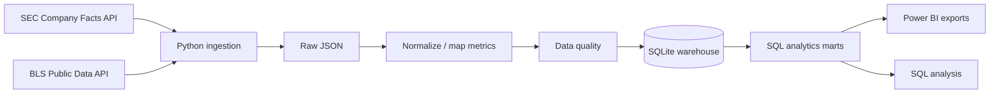

# Financial Analytics Platform

A financial-data pipeline that pulls public company facts and economic data, turns them into a small SQL warehouse, and prepares the result for analysis in Power BI.

I wanted this project to be more than another dashboard where most of the work is hidden inside Power Query or DAX. The dashboard is only the last part. The main part is getting data from different public sources, deciding which financial facts are actually comparable, keeping the source evidence, validating the result, and building an analytics layer that can be reused outside Power BI.

## What this project does

The platform combines:

- SEC Company Facts / XBRL data for public-company financial statements
- BLS public economic data for CPI and unemployment
- Python ingestion and normalization
- SQL dimensions, facts, views and analytical marts
- data-quality checks
- Power BI-ready exports and DAX/model documentation



## Why I built it this way

One thing I wanted to avoid was putting all of the business logic inside the dashboard.

If revenue mapping, filing selection, ratios and validation only exist inside Power BI, it becomes harder to test them and harder to reuse the same data somewhere else. In this project the source ingestion and core transformation happen before the dashboard layer.

The Power BI model receives data that has already gone through a defined pipeline.

## Default company set

| Ticker | Company |
| --- | --- |
| AAPL | Apple Inc. |
| MSFT | Microsoft Corporation |
| GOOGL | Alphabet Inc. |
| AMZN | Amazon.com, Inc. |
| META | Meta Platforms, Inc. |
| NVDA | NVIDIA Corporation |

The company list is config-driven.

## Financial metrics

The current canonical model includes Revenue, Operating Income, Net Income, Operating Cash Flow, Capital Expenditure, Total Assets, Total Liabilities and Stockholders' Equity.

The SQL layer derives YoY growth, Profit Margin, Operating Margin, Debt to Assets, ROA, ROE and Capex to Operating Cash Flow.

## The SEC mapping problem

A metric such as revenue does not always arrive under exactly the same XBRL tag for every company and period.

Instead of hardcoding one concept, the mapping is configurable:

```yaml
revenue:
  metric_key: 1
  metric_name: Revenue
  unit: USD
  period_type: duration
  concepts:
    - RevenueFromContractWithCustomerExcludingAssessedTax
    - Revenues
    - SalesRevenueNet
```

The selected source concept, filing date and accession number stay attached to the fact so the result remains traceable.

## Data model

Core tables:

```text
dim_company
dim_metric
dim_macro_series
fact_financial_metric
fact_macro_indicator
```

Analytics views:

```text
mart_company_yearly
mart_macro_monthly
mart_company_economic_context
```

See `docs/data-model.md` and `sql/` for the full implementation.

## Power BI

The pipeline exports Power BI-ready CSV tables under:

```text
output/powerbi/
```

The `powerbi/` folder contains:

- semantic model design
- relationships
- DAX measures
- report-page plan
- setup instructions

I am keeping this as a design pack until it has been opened and validated in Power BI Desktop. I do not want to commit a hand-written PBIP and imply Power BI has validated it when it has not.

## Installation

Python 3.11+ is recommended.

```bash
git clone https://github.com/ycailon/financial-analytics-platform.git
cd financial-analytics-platform
python -m venv .venv
```

Windows PowerShell:

```powershell
.venv\Scripts\Activate.ps1
```

Install:

```bash
pip install -e ".[dev]"
```

## Run the offline demo

```bash
financial-analytics demo
```

No API key or internet connection is required.

The demo goes through the complete pipeline and currently produces:

```text
6 companies
240 financial fact rows
120 macro fact rows
30 company/year mart rows
```

The demo financial values are synthetic. A small output sample is committed under `examples/`.

## Run with real public data

SEC does not require an API key, but automated access should identify the client.

Copy:

```bash
cp .env.example .env
```

and set:

```text
SEC_USER_AGENT="Your Name your.email@example.com"
```

Then run:

```bash
financial-analytics refresh --start-year 2020 --end-year 2026
```

The default BLS request uses the public/unregistered API path, so no BLS API key is required.

## Testing

```bash
pytest
```

Current local result:

```text
6 passed
```

The tests cover SEC annual-fact selection, concept priority, BLS transformation, data-quality rules, and the complete offline pipeline through the warehouse and Power BI exports.

Static checks:

```bash
ruff check src tests
```

## Engineering decisions

- Keep financial facts long and create wide marts later.
- Keep company and metric mappings in config.
- Preserve SEC lineage instead of only storing the final value.
- Report missing coverage rather than inventing data.
- Use SQLite by default so the project can run without database-server setup.
- Treat CPI/unemployment as context, not proof of causation.

## Current limitations

- Annual 10-K analysis only; no 10-Q model yet.
- The canonical financial metric set is intentionally small.
- Company-specific extension XBRL tags are not automatically mapped.
- No full restatement-history ledger yet.
- The Power BI folder is a reviewed design specification, not a PBIX/PBIT binary.

## Sources

- SEC EDGAR APIs: https://www.sec.gov/search-filings/edgar-application-programming-interfaces
- SEC fair-access guidance: https://www.sec.gov/search-filings/edgar-search-assistance/accessing-edgar-data
- BLS Public Data API: https://www.bls.gov/developers/home.htm
- BLS API FAQ: https://www.bls.gov/developers/api_faqs.htm
- Power BI Desktop projects: https://learn.microsoft.com/en-us/power-bi/developer/projects/projects-overview

## Portfolio note

The live pipeline is built for public SEC and BLS data. The offline example data in this repository is synthetic and exists so the complete system can be reviewed and tested without depending on external services.
