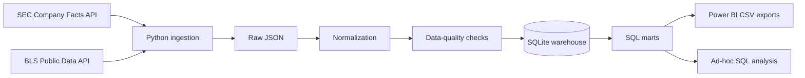

# Architecture

## Layers

### Source

- SEC Company Facts API for standardized XBRL facts from public-company filings.
- BLS Public Data API for CPI and unemployment series.

### Raw

Live source payloads are written to `data/raw/`. They are intentionally ignored by Git so a refresh can be reproduced without turning the repository into a data dump.

### Transformation

The SEC transformation maps several possible US-GAAP concepts into a smaller canonical metric set. Annual 10-K facts are selected by fiscal year and duration. When more than one configured concept can represent the same metric, the configured concept priority is used.

BLS monthly observations are normalized into `series_key`, `observation_date`, and `value`.

### Warehouse

SQLite is the default warehouse because it keeps the project runnable with no server setup. The SQL model is still structured as dimensions, facts and analytics marts rather than treating SQLite as a flat-file store.

### BI

The pipeline exports clean CSV tables under `output/powerbi/`. This makes the Power BI layer reproducible and keeps dashboard logic separate from source ingestion.
