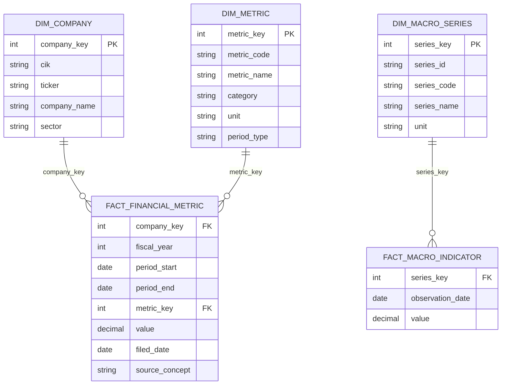

# Data model

```mermaid
erDiagram
    DIM_COMPANY ||--o{ FACT_FINANCIAL_METRIC : company_key
    DIM_METRIC ||--o{ FACT_FINANCIAL_METRIC : metric_key
    DIM_MACRO_SERIES ||--o{ FACT_MACRO_INDICATOR : series_key

    DIM_COMPANY {
        int company_key PK
        string cik
        string ticker
        string company_name
        string sector
    }

    DIM_METRIC {
        int metric_key PK
        string metric_code
        string metric_name
        string category
        string unit
        string period_type
    }

    FACT_FINANCIAL_METRIC {
        int company_key FK
        int fiscal_year
        date period_start
        date period_end
        int metric_key FK
        decimal value
        date filed_date
        string source_concept
    }

    DIM_MACRO_SERIES {
        int series_key PK
        string series_id
        string series_code
        string series_name
        string unit
    }

    FACT_MACRO_INDICATOR {
        int series_key FK
        date observation_date
        decimal value
    }
```

The Power BI export adds a generated `dim_date.csv` so both financial period-end dates and monthly macro observations can use a shared date dimension.
